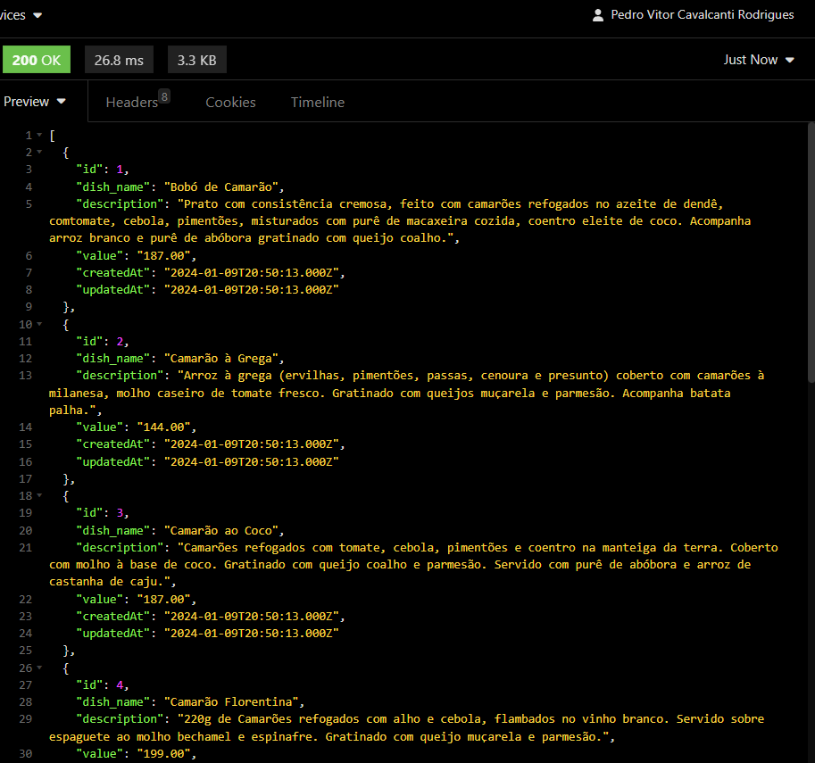
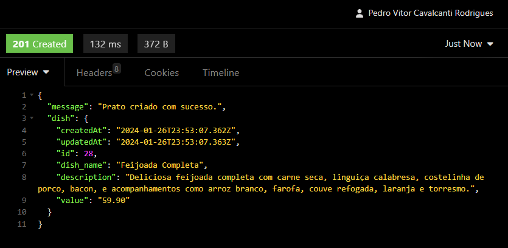
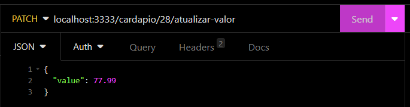
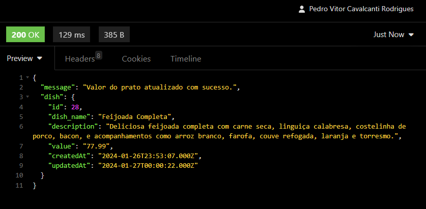
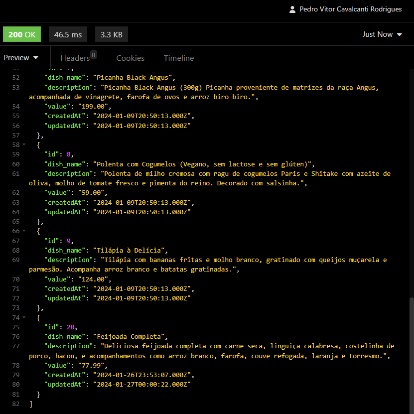

# Microserviço de Gerenciamento de Pratos para Cardápio de um Restaurante

Este é o backend de um microserviço Node.js para o cadastro de pratos no cardápio de um restaurante. Ele utiliza Express.js e Sequelize ORM para interagir com o banco de dados MySQL.

## Como Usar

### Pré-requisitos

- Node.js e npm instalados
- MySQL instalado e configurado

### Instalação

1. Clone este repositório:

2. Instale as dependências: 

   - **npm install**

3. Configure as variáveis de ambiente:

Crie um arquivo `.env` na raiz do projeto e defina as seguintes variáveis:

    DB_USER='seu_usuario'
    DB_PASS='sua_senha'
    DB_NAME='nome_do_banco_de_dados'
    DB_HOST='host_do_banco_de_dados''
    DB_PORT='porta_do_banco_de_dados
    DB_DIALECT='dialeto_do_banco_de_dados' 

### Execução

1. Execute as migrações do banco de dados para criar as tabelas necessárias:

   - **npx sequelize-cli db:migrate**

2. Inicie o servidor:

   - **npm start**

O servidor estará em execução em `http://localhost:3333`.

### Testando a API

Você pode usar ferramentas como Postman ou Insomnia para testar os endpoints da API:

- **GET /cardapio**: Retorna o cardápio completo.
- **POST /cardapio/criar-prato**: Cria um novo prato no cardápio.
  - Parâmetros: `dish_name`, `description`, `value`.
- **DELETE /cardapio/:id/apagar-prato**: Apaga um prato do cardápio.
- **PATCH /cardapio/:id/atualizar-valor**: Atualiza o valor de um prato no cardápio.

### Exemplos de Teste com o Insomnia

#### GET /cardapio

#### POST /cardapio/criar-prato

#### DELETE /cardapio/:id/apagar-prato

#### PATCH /cardapio/:id/atualizar-valor

#### GET /cardapio - Após os testes feitos

### Estrutura do Projeto

O projeto segue o padrão MVC (Model-View-Controller), organizado da seguinte forma:

- `server.js`: Arquivo principal que inicia o servidor Express e define como lidar com as requisições HTTP.
- `src/`: Contém o código-fonte do projeto.
  - `src/controllers`: Controladores para lidar com as requisições HTTP.
  - `src/middlewares`: Middlewares para validação de entrada.
  - `src/models`: Definição dos modelos Sequelize.
  - `src/routes`: Definição dos endpoints da API.
  - `src/database`: Configuração do banco de dados e migrações.
- `package.json`: Arquivo de manifesto do Node.js com as dependências e scripts.
- `.sequelizerc`: Configuração do Sequelize CLI.
- `.gitignore`: Arquivos e pastas ignorados pelo Git.

## Contribuindo

Contribuições são bem-vindas! Sinta-se à vontade para abrir uma issue para relatar bugs ou propor novas funcionalidades. Pull requests também são encorajados.